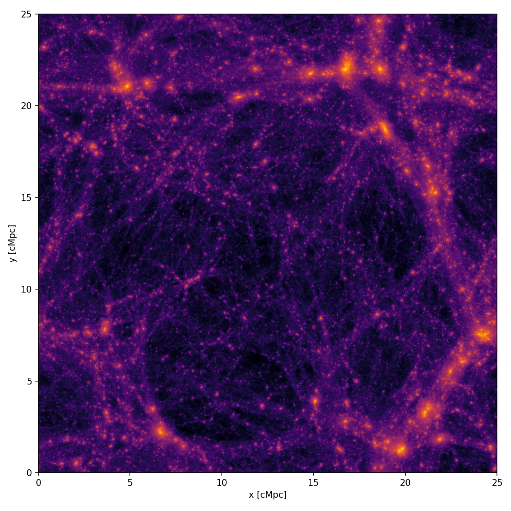

swiftsimio
==========

The `swiftsimio <https://swiftsimio.readthedocs.io/en/latest/>`__
python module can be used to read snapshots and soap catalogues.
It handles units and cosmology metadata, and can be used to
efficiently load specific subvolumes for the full box.
It also contains functions for visualisation and volume rendering.

There are two ways to get at the data:

  * Use swiftsimio to read files held on the server through the
    `hdfstream <https://hdfstream-python.readthedocs.io/en/latest>`__
    service, without downloading them first.
  * :doc:`Download </service_docs/index>` the files you need and open them
    directly.

Reading remotely is usually preferable when you only need a small part of a
file, such as a single particle type or a region around an object of interest.

Installation
------------

The swiftsimio module can be installed as follows::

  pip install swiftsimio

For remote access we also need the hdfstream module::

  pip install hdfstream

Opening a snapshot
------------------

Each snapshot consists of a large number of data files and a single
:ref:`virtual snapshot file <virtual-snapshot>`. Swiftsimio
should be given the name of the virtual snapshot file, which
references the data in all of the other files. Here we open the
:math:`z=1` snapshot of the L025m7 simulation.

.. tab-set::

   .. tab-item:: Opening a remote file

      .. code-block:: python

         import hdfstream
         import swiftsimio as sw

         # Connect to the data service and open the root directory
         root_dir = hdfstream.open("cosma", "/")

         run = "COLIBRE/L025_m7/DMO"
         snap_nr = 92 # z=1
         path = f"{run}/SOAP-HBT/colibre_with_SOAP_membership_{snap_nr:04}.hdf5"

         # A remote file object can be passed to swiftsimio in place of a filename
         snapshot_file = root_dir[path]

         snap = sw.load(snapshot_file)

   .. tab-item:: Opening a local file

      .. code-block:: python

         import swiftsimio as sw

         # Path to the files you have downloaded
         run = "COLIBRE/L025_m7/DMO"
         snap_nr = 92 # z=1
         snapshot_file = f"{run}/SOAP-HBT/colibre_with_SOAP_membership_{snap_nr:04}.hdf5"

         snap = sw.load(snapshot_file)

The rest of this page uses ``snapshot_file``, so the examples below work
whichever of the two you used.

Snapshot metadata
-----------------

The ``snap`` object
returned by ``swiftsimio.load`` can be used to access simulation
metadata. The simulation box size is available as::

  snap.metadata.boxsize

If you need cosmology information, you can get an astropy `cosmology
object <https://docs.astropy.org/en/stable/cosmology/index.html>`__
with::

  cosmo = snap.metadata.cosmology

This allows accurate calculation of the age of the universe or the
comoving distance at a particular redshift in the COLIBRE cosmology,
for example. The numbers of particles of each type in the snapshot are
available as::

  snap.metadata.n_dark_matter
  snap.metadata.n_neutrinos

The expansion factor and redshift of the snapshot are also available::

  snap.metadata.a
  snap.metadata.z

To see what particle types exist in this snapshot::

  >>> print(snap)
  SWIFT dataset at COLIBRE/L025_m7/DMO/SOAP-HBT/colibre_with_SOAP_membership_0092.hdf5. 
  Available groups: dark_matter, neutrinos

And to see the particle properties available for one particle type::

  >>> print(snap.dark_matter)
  SWIFT dataset at COLIBRE/L025_m7/DMO/SOAP-HBT/colibre_with_SOAP_membership_0092.hdf5. 
  Available fields: coordinates, fofgroup_ids, group_nr_bound, halo_catalogue_index, masses, particle_ids, potentials, rank_bound, specific_potential_energies, velocities

See the `swiftsimio documentation
<https://swiftsimio.readthedocs.io/en/latest/loading_data/index.html#using-metadata>`__
on snapshot metadata for more information.

Reading particle data
---------------------

Particle properties, such as position, mass or velocity, are only read in
or when you try to access them. You can see what properties are 
available by using tab completion. To read the coordinates of
all dark matter particles in the simulation::

  dm_pos = snap.dark_matter.coordinates

The result is a `cosmo_array
<https://swiftsimio.readthedocs.io/en/latest/cosmo_array/index.html>`__,
which is is a numpy array with unit and cosmology information
attached. Units are handled using the `unyt
<https://unyt.readthedocs.io/en/stable/>`__ module. In this example,
the cosmo array records that the particle positions are in comoving
Mpc::

   >>>  print(dm_pos)
   [[6.72585729e-01 2.76213729e-01 3.18276073e+00]
    [7.80392729e-01 6.61870729e-01 3.59051173e+00]
    [2.21917288e-02 1.27776973e+00 3.66487173e+00]
    ...
    [2.34653514e+01 2.40933144e+01 2.49001234e+01]
    [2.34675064e+01 2.40928574e+01 2.48974284e+01]
    [2.40909894e+01 2.49992534e+01 2.48510784e+01]] Mpc (Comoving)

Arrays can easily be converted to different units, and between comoving
and physical. **You should should always specify the units you want**::

   >>> print(dm_pos.to_physical().to('kpc'))
   [[3.36292864e+02 1.38106864e+02 1.59138036e+03]
    [3.90196364e+02 3.30935364e+02 1.79525586e+03]
    [1.10958644e+01 6.38884864e+02 1.83243586e+03]
    ...
    [1.17326757e+04 1.20466572e+04 1.24500617e+04]
    [1.17337532e+04 1.20464287e+04 1.24487142e+04]
    [1.20454947e+04 1.24996267e+04 1.24255392e+04]] kpc (Physical)

The property descriptions can also be access from the ``cosmo_array``::

   >> print(snap.dark_matter.masses.name)
   Masses of the particles

Opening a SOAP catalogue
------------------------

SOAP catalogues can be also be loaded using swiftsimio

.. tab-set::

   .. tab-item:: Opening a remote file

      .. code-block:: python

         import hdfstream
         import swiftsimio as sw

         root_dir = hdfstream.open("cosma", "/")

         run = "COLIBRE/L025_m7/DMO"
         snap_nr = 92 # z=1
         soap_file = root_dir[f"{run}/SOAP-HBT/halo_properties_{snap_nr:04}.hdf5"]

         soap = sw.load(soap_file)

   .. tab-item:: Opening a local file

      .. code-block:: python

         import swiftsimio as sw

         run = "COLIBRE/L025_m7/DMO"
         snap_nr = 92 # z=1
         soap_file = f"{run}/SOAP-HBT/halo_properties_{snap_nr:04}.hdf5"

         soap = sw.load(soap_file)

Both metadata and datasets are accessed in a similar way to the snapshots.
SOAP computes halo properties using several different halo
definitions, which are described in :doc:`../soap/soap_halo_variations`. We
can see what halo definitions are available in the output we opened
above with::

  >>> print(soap)
  SWIFT dataset at COLIBRE/L025_m7/DMO/SOAP-HBT/halo_properties_0092.hdf5. 
  Available groups: bound_subhalo, exclusive_sphere_100kpc

Similarly, we can find the list of halo properties which are available
for a particular halo definition. If we're interested in properties
evaluated using the particles bound to each subhalo, for example, the
following will return the names of the available properties (they can 
also by discovered by using tab completion)::

  >>> print(soap.bound_subhalo)
  SWIFT dataset at COLIBRE/L025_m7/DMO/SOAP-HBT/halo_properties_0092.hdf5
  Available fields: total_inertia_tensor_noniterative, ... , centre_of_mass, ... , total_mass, ...

The available halo properties are fully documented in the
:ref:`soap_property_table`
The datasets all have the same length (equal to the number of subhalos) 
and are always sorted in the same order.
However, due to a combination of the fact that we do not compute
spherical overdensity properties for satellites and
the filters we use, many values will be zero. For example, we only
compute dark matter concentration for objects with at least 100 particles::

  >>> print(soap.input_halos.number_of_bound_particles)
  [171 293 178 ...  36  25  32] dimensionless (Physical)
  >>> print(soap.spherical_overdensity_200_crit.concentration)
  [11.953125  9.890625  6.21875  ...  0.        0.        0.      ] dimensionless (Physical)

Masking
-------

The particles in Swift snapshots are ordered in a way that allows us
to read regions from a snapshot without reading the entire file. Given
a range of coordinates in x, y, and z, swiftsimio can compute which
parts of the file to read or download to find the corresponding
particles. This is referred to as `spatial masking
<https://swiftsimio.readthedocs.io/en/latest/masking/>`__, and can
significantly reduce the time spent loading data.

.. important::
  Spatial only masking is approximate and allows you to only load particles within a given region. It is precise to the top-level cells that are defined within SWIFT. This means it will always load all of the particles in the region that you request, but it may also load some particles that are slightly outside of the region of interest.

.. code-block:: python

   # Create a mask object
   mask = sw.mask(snapshot_file)
   boxsize = mask.metadata.boxsize

   # Specify the region of the box we want to load (this requires units)
   load_region = [[0.1 * b, 0.3 * b] for b in boxsize]

   # Constrain the region to read
   mask.constrain_spatial(load_region)

   # Open the snapshot using the mask. If snapshot_file is a remote file,
   # only the particles in the region are downloaded.
   snap = sw.load(snapshot_file, mask=mask)

   # Read the coordinates of dark matter particles in the region
   dm_pos = snap.dark_matter.coordinates

Visualisation
-------------

Sometimes being able to visualise regions of the simulation can help provide insights into the data you are working with. `Swiftsimio supports multiple options for this <https://swiftsimio.readthedocs.io/en/latest/visualisation/index.html>`__. Here we give the example of projecting the dark matter density.

Dark matter particles do not carry a smoothing length, so one has to be
generated before the particles can be projected onto a grid.

.. code-block:: python

   import matplotlib.pyplot as plt
   from matplotlib.colors import LogNorm
   from swiftsimio.visualisation.projection import project_pixel_grid
   from swiftsimio.visualisation.smoothing_length import generate_smoothing_lengths

   snap = sw.load(snapshot_file)
   boxsize = snap.metadata.boxsize[0].to('Mpc').value
   extent = [0, boxsize, 0, boxsize]

   # Generate smoothing lengths for the dark matter
   snap.dark_matter.smoothing_length = generate_smoothing_lengths(
       snap.dark_matter.coordinates,
       snap.metadata.boxsize,
       kernel_gamma=1.8,
       neighbours=57,
       speedup_fac=2,
       dimension=3,
   )

   # Project the dark matter mass. Note that we pass the dark matter dataset
   # rather than the whole snapshot, to specify the particle type to visualise.
   mass_map = project_pixel_grid(
       data=snap.dark_matter,
       resolution=128,
       project="masses",
       parallel=True,
       region=None,
       periodic=True,
   )

   mass_map = mass_map.to('Msun/kpc**2').value

   plt.imshow(LogNorm()(mass_map), cmap="inferno", extent=extent)

